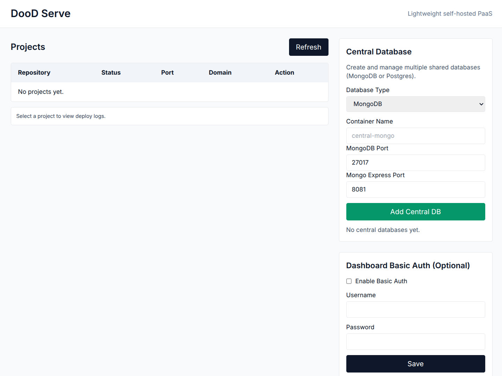
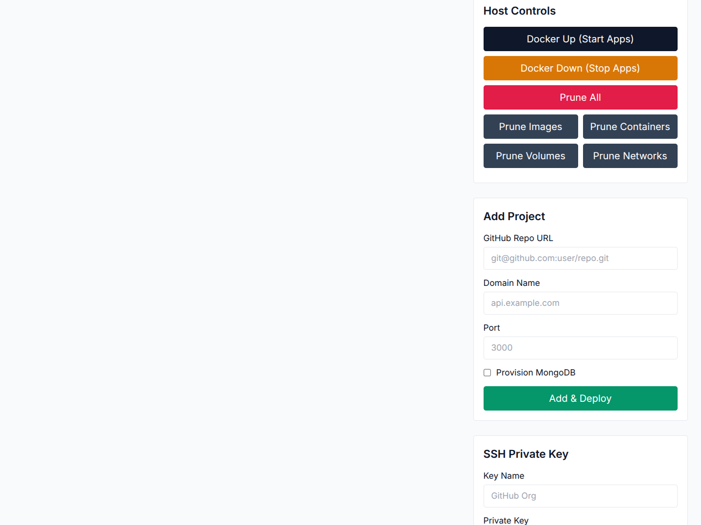

# DooD Serve

**Made by Galib · Made by Intelleeo.com**

DooD Serve is a very lightweight alternative inspired by Dokploy, Coolify, and Vercel, built for limited-resource servers. It runs in a single container and manages the host Docker engine (Docker‑out‑of‑Docker). It provides a minimal Web UI for deployments, central databases, and ops controls.

**Author / Credit:** Sheikh Yeasin Ahsanullah Al-Galib (SYAAGalib)

## Highlights

- Hono + TypeScript backend
- HTMX + Tailwind UI
- SQLite config store
- Docker control via dockerode
- Central DB management (MongoDB/Postgres + admin UIs)
- GitHub webhook deployments

## Quick Start

1. Configure your VPS with Docker and Docker Compose.
2. Clone the repo.
3. Start:
   - `docker compose up -d --build`
4. Open: http://<server-ip>:8080

## Core Concepts

- **Projects**: Git repos that build into Docker images and run as containers.
- **Central DBs**: Multiple MongoDB/Postgres containers with named volumes.
- **Auth**: First‑time setup creates the initial admin. Optional Basic Auth exists.

## Security Notes

- SSH key is saved with strict permissions and locked once stored.
- Caddy auto‑TLS for domains when DNS is configured.
- Central DBs require credentials; admin UIs can be stopped when not needed.

## License

See [LICENSE](LICENSE). Non‑commercial use only. Attribution required.
